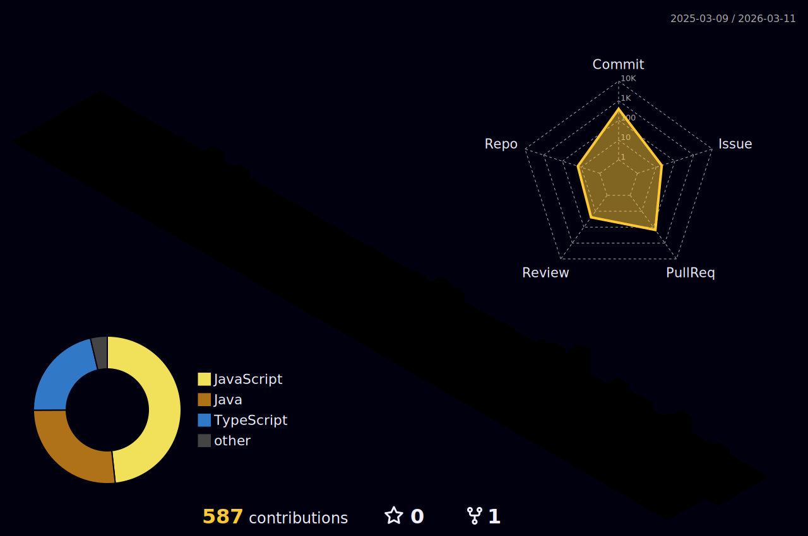

<!--
**DongEun02/DongEun02** is a ✨ _special_ ✨ repository because its `README.md` (this file) appears on your GitHub profile.

Here are some ideas to get you started:

- 🔭 I’m currently working on ...
- 🌱 I’m currently learning ...
- 👯 I’m looking to collaborate on ...
- 🤔 I’m looking for help with ...
- 💬 Ask me about ...
- 📫 How to reach me: ...
- 😄 Pronouns: ...
- ⚡ Fun fact: ...
-->

    
    

    
 
    <!-- <h2 style="border-bottom: 1px solid #21262d; color: #c9d1d9;">  </h2>   -->
    
 웹 프론트엔드(Web Frontend) 개발자입니다. 
 
    

    

    <h2 style="border-bottom: 1px solid #21262d; color: #c9d1d9;"> 🛠️ Tech Stacks </h2>   
    
 
          
          
          
          
           
          
          
          
          
           
          
          
          
          
           
          
          
          
          

    

    

    <h2 style="border-bottom: 1px solid #21262d; color: #c9d1d9;"> 🧑‍💻 Contact me </h2>   
    
 
          
    
    
  
 
    

    
 
    <h2 style="border-bottom: 1px solid #21262d; color: #c9d1d9;"> 🏅 Stats </h2> 
   
 
    

    
---

