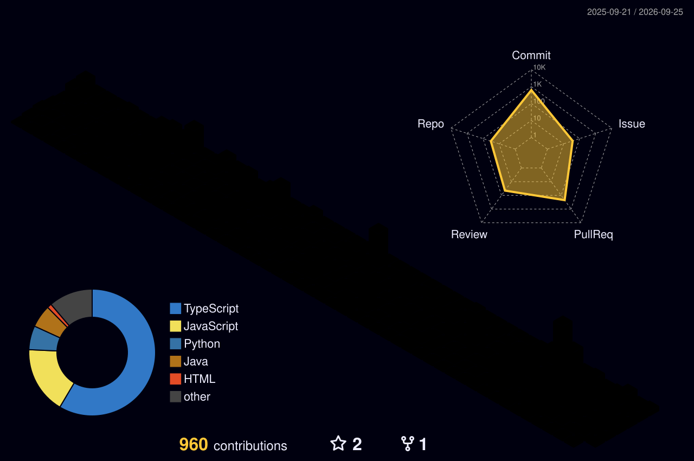

  

  <h1>Hi, I'm Dongeun 👋</h1>

  

    <strong>Frontend Developer passionate about clean code 
    and maintainable web applications.</strong>
  

  

    <samp>Clean Code · Thoughtful Refactoring · React · TypeScript</samp>
  

 

<table>
  <tr>
    <td width="50%" valign="top">
      <h3>🧹 What I value</h3>
      
I enjoy turning complicated code into simple, readable structures.

      <ul>
        <li>Clean and expressive code</li>
        <li>Thoughtful refactoring</li>
        <li>Maintainable architecture</li>
      </ul>
    </td>
    <td width="50%" valign="top">
      <h3>🌱 Current focus</h3>
      
I am continuously deepening my frontend knowledge.

      <ul>
        <li>React &amp; TypeScript</li>
        <li>Woowa Course 8th</li>
        <li>Open-source contribution</li>
      </ul>
    </td>
  </tr>
</table>

<h2>🚀 Featured Work</h2>

<table>
  <tr>
    <td width="50%" valign="top">
      <h3><a href="https://github.com/DongEun02/Giyeoro">Giyeoro</a></h3>
      
An issue recommendation service for aspiring open-source contributors.

      
<code>TypeScript</code> <code>React</code>

    </td>
    <td width="50%" valign="top">
      <h3><a href="https://github.com/DongEun02/woowacourse-archive">Woowa Course Archive</a></h3>
      
Projects, notes, and learning records from Woowa Course.

      
<code>Learning</code> <code>Frontend</code>

    </td>
  </tr>
</table>

  
<strong>🌍 Open-source Contributions</strong>

   
  

    <a href="https://github.com/DongEun02/ko.react.dev"><strong>React Docs · Korean</strong></a>
    — Contributing to the Korean React documentation
      
    <a href="https://github.com/DongEun02/es-toolkit"><strong>es-toolkit</strong></a>
    — Contributing to a modern JavaScript utility library
  

 

<h2>🛠 Tech Stack</h2>

  

    
    
    
    
  

  

    
    
    
    
  

<h2>📊 GitHub Activity</h2>

  <picture>
    <source media="(prefers-color-scheme: dark)" srcset="https://github-readme-stats-ty7g.vercel.app/api?username=DongEun02&show_icons=true&hide_border=true&theme=github_dark&cache_seconds=21600&v=2" />
    <source media="(prefers-color-scheme: light)" srcset="https://github-readme-stats-ty7g.vercel.app/api?username=DongEun02&show_icons=true&hide_border=true&theme=default&cache_seconds=21600&v=2" />
    
  </picture>
  <picture>
    <source media="(prefers-color-scheme: dark)" srcset="https://github-readme-stats-ty7g.vercel.app/api/top-langs/?username=DongEun02&layout=compact&hide_border=true&theme=github_dark" />
    <source media="(prefers-color-scheme: light)" srcset="https://github-readme-stats-ty7g.vercel.app/api/top-langs/?username=DongEun02&layout=compact&hide_border=true&theme=default" />
    
  </picture>

 

  
<strong>🌈 More contribution activity</strong>

   
  

    
  

 

  <h3>Let's connect</h3>
  
<samp>Let's build something clean and useful.</samp>

  

